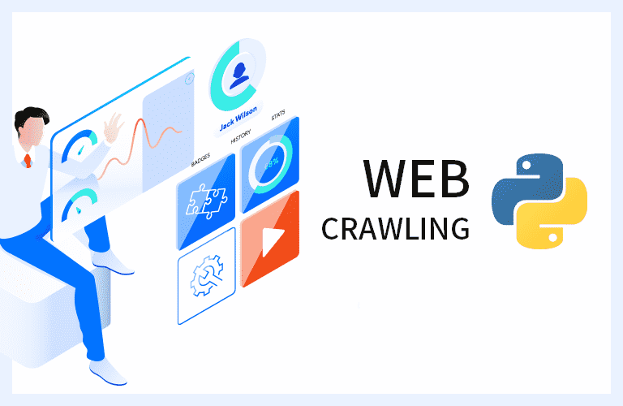

   
  
   
  <h1>웹 크롤링 (Web Crawling)</h1>
   

## 목차

1. [기본 크롤링](https://github.com/JeongHwan-dev/Crawling_with_Python/tree/master/Ch01_FundamentalCrawling)
2. [다중 페이지 크롤링](https://github.com/JeongHwan-dev/Crawling_with_Python/tree/master/Ch02_CrawlingMultiplePages)
3. [API를 활용한 크롤링](https://github.com/JeongHwan-dev/Crawling_with_Python/tree/master/Ch03_CrawlingWithAPI)
4. [크롤링 과제](https://github.com/JeongHwan-dev/Crawling_with_Python/blob/master/Crawling_Assignments/crawling_StockData.py)
